# Jarkom-Modul-1-2026-K-36

**Kelompok** : K-36

**Anggota** :

| Nama                    | NRP        |
| ----------------------- | ---------- |
| Nazwa Aulia Dwi Purnomo | 5027251018 |
| Putri Permata Sabila    | 5027251047 |

## Laporan Resmi

### Soal 1

Soal 1 minta router Lain bikin 3 Switch/Gateway: Switch 1 ke Alice & Mika, Switch 2 ke Chisa, Switch 3 ke Knights & Eiri, semua Entitas dikonfigurasi sebagai Client di GNS3 pakai prefix IP kelompok.

Router (Lain) — eth1, eth2, eth3 masing-masing jadi gateway satu switch:

```sh
auto eth1
iface eth1 inet static
address 192.229.1.1
netmask 255.255.255.0

auto eth2
iface eth2 inet static
address 192.229.2.1
netmask 255.255.255.0

auto eth3
iface eth3 inet static
address 192.229.3.1
netmask 255.255.255.0
```

Alice dan Mika (Switch 1):

```sh
# Alice
auto eth0
iface eth0 inet static
address 192.229.1.2
netmask 255.255.255.0
gateway 192.229.1.1

# Mika
auto eth0
iface eth0 inet static
address 192.229.1.3
netmask 255.255.255.0
gateway 192.229.1.1
```

Chisa (Switch 2)

```sh
# Chisa
auto eth0
iface eth0 inet static
address 192.229.2.2
netmask 255.255.255.0
gateway 192.229.2.1

```

Eiri dan Knights (Switch 3):

```sh
# Eiri
auto eth0
iface eth0 inet static
address 192.229.3.2
netmask 255.255.255.0
gateway 192.229.3.1

# Knights
auto eth0
iface eth0 inet static
address 192.229.3.3
netmask 255.255.255.0
gateway 192.229.3.1

```

#### Output

## 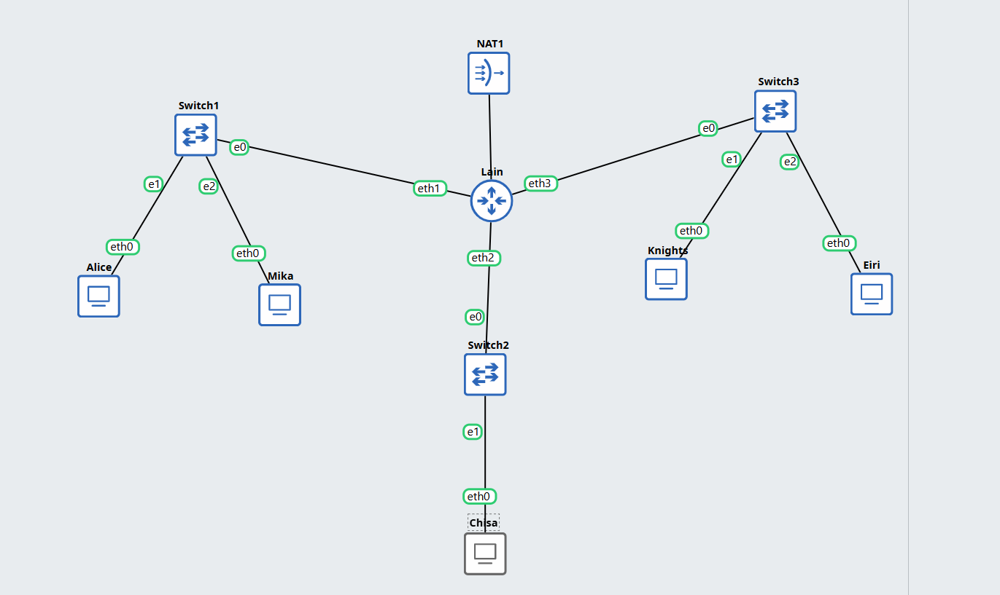

### Soal 2

Soal 2 minta router Lain konek ke internet publik lewat NAT/DHCP di interface eth0, soalnya The Wired awalnya masih terisolasi.

```sh
auto eth0
iface eth0 inet dhcp
```

eth0 dibiarin dapat IP otomatis dari DHCP jaringan luar, jadi router langsung punya akses internet tanpa perlu setting IP manual.

---

### Soal 3

Pada soal 3 seluruh Entitas di bawah Switch 1, 2, dan 3 harus bisa saling terhubung dan berkomunikasi lewat konfigurasi routing.

Karena router Lain terhubung langsung ke ketiga subnet lewat eth1, eth2, dan eth3, routing antar subnet sudah terbentuk otomatis dari routing table router tanpa perlu tambahan konfigurasi khusus. Pembuktiannya dilakukan dengan ping ke IP Address Entitas di subnet lain:

```sh
ping -c 2 <IP_tujuan>
```

#### Output

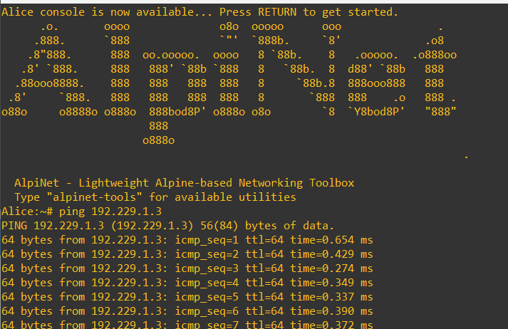
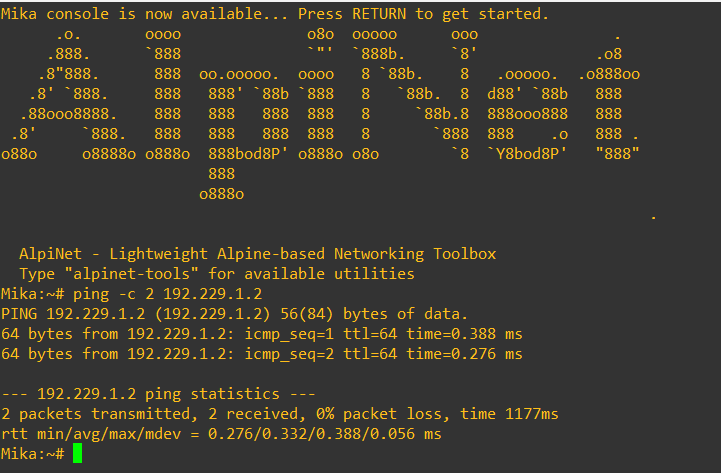
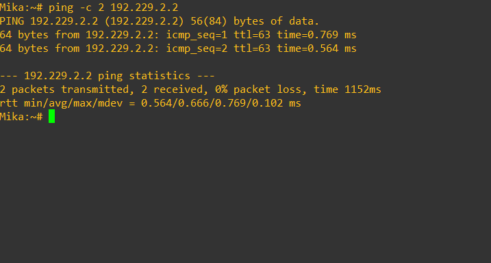
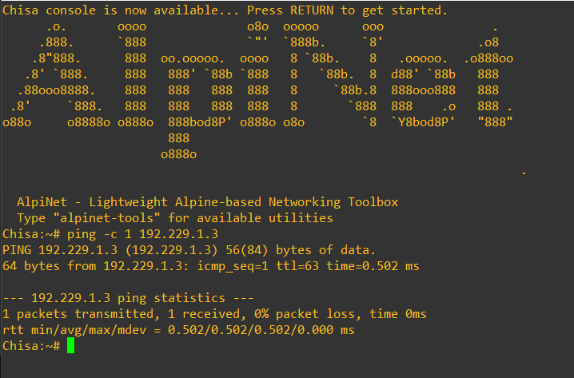

---

#### Soal 4

Pada soal 4 tiap Entitas diminta mandiri akses internet, bisa ping ke 8.8.8.8 dan buka google.com, lewat konfigurasi firewall/iptables NAT Masquerade dan DNS resolver.

Langkah pertama, buat file `router.sh` di router Lain yang isinya command NAT dan forwarding:

```sh
iptables -t nat -A POSTROUTING -o eth0 -j MASQUERADE
iptables -A FORWARD -i eth1 -o eth0 -j ACCEPT
iptables -A FORWARD -i eth2 -o eth0 -j ACCEPT
iptables -A FORWARD -i eth3 -o eth0 -j ACCEPT
```

`MASQUERADE` dan `FORWARD` ini dua hal yang beda fungsi. `MASQUERADE` di tabel `nat` bertugas nge-rewrite source IP private client (192.229.x.x) jadi IP publik router pas paket keluar lewat eth0, supaya balasan dari internet bisa balik lagi ke router dan di-translate ulang ke client yang benar. Tanpa ini, client dengan IP private gak akan bisa langsung diajak komunikasi sama server di internet.

`FORWARD` di sisi lain ngatur izin, boleh atau enggak sebuah paket lewat (diteruskan) dari satu interface ke interface lain di router. Default policy `FORWARD` di banyak sistem itu `ACCEPT`, makanya soal 3 tadi bisa langsung jalan tanpa rule tambahan. Tapi kalau default policy-nya `DROP`, paket dari client yang mau keluar ke eth0 (internet) bakal ketahan di router meskipun NAT-nya udah bener. Jadi tiga baris `ACCEPT` itu ditambahin buat mastiin secara eksplisit trafik dari eth1, eth2, dan eth3 menuju eth0 diizinkan lewat, jaga-jaga kalau default policy-nya ketat.

Untuk DNS resolver, tiap client diset otomatis pas interface naik, contoh di Eiri:

```sh
auto eth0
iface eth0 inet static
address 192.229.3.3
netmask 255.255.255.0
gateway 192.229.3.1
up echo "nameserver 8.8.8.8" > /etc/resolv.conf
```

`8.8.8.8` itu alamat Google Public DNS, dipakai supaya client bisa nerjemahin nama domain (google.com) jadi IP address. Tanpa ini client cuma bisa akses internet pakai IP langsung, gak bisa buka website lewat nama domainnya.

Baris `up echo "nameserver 8.8.8.8" > /etc/resolv.conf` itu bagian dari `/etc/network/interfaces`, bukan file terpisah. `up` di sini artinya command yang dijalankan otomatis tiap kali interface eth0 naik. Isi command-nya sendiri nulis ke `/etc/resolv.conf`, file khusus yang nyimpen daftar DNS server yang dipakai sistem buat resolve domain (terpisah dari `/etc/network/interfaces` yang isinya konfigurasi IP address dan routing interface). Jadi gak perlu edit manual `/etc/resolv.conf` di terminal, cukup taruh baris `up echo ...` itu di dalam `/etc/network/interfaces` (edit pakai `nano /etc/network/interfaces` di terminal), dan tiap kali eth0 up, `/etc/resolv.conf` otomatis ke-generate ulang. Cara yang sama diterapin ke Alice, Mika, Chisa, dan Knights.

#### Output

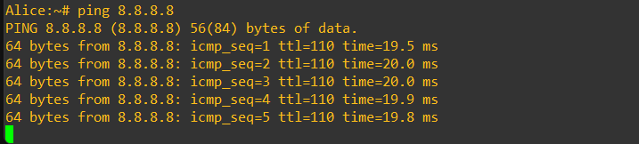
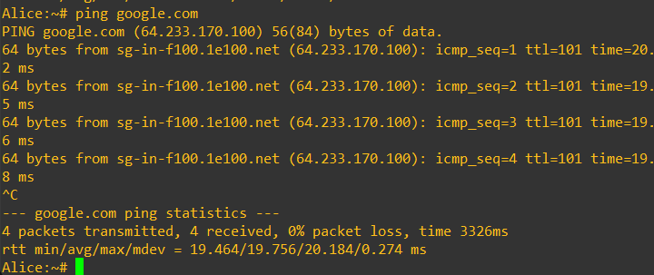

---

### Soal 5

Pada soal 5 diminta membuat script verifikasi `/root/cek_status.sh` di router Lain yang menampilkan ringkasan interface (`ip -br a`) dan status tabel NAT (`iptables -t nat -L -v -n`), buat antisipasi kalau node di-restart mendadak.

```sh
nano /root/cek_status.sh
```

Isi `cek_status.sh`:

```sh
#!/bin/bash
ip -br a
iptables -t nat -L -v -n
```

```sh
chmod +x /root/cek_status.sh
```

Script ini ditaruh di `init.sh` supaya otomatis jalan tiap kali router boot atau di-restart:

```sh
/root/router.sh
/root/cek_status.sh
```

Jadi begitu router Lain nyala ulang, `router.sh` langsung nerapin ulang aturan NAT dan forwarding, sedangkan `cek_status.sh` langsung nampilin ringkasan interface dan status tabel NAT buat mastiin konfigurasinya masih sesuai, tanpa perlu ngecek manual satu-satu.

#### Output

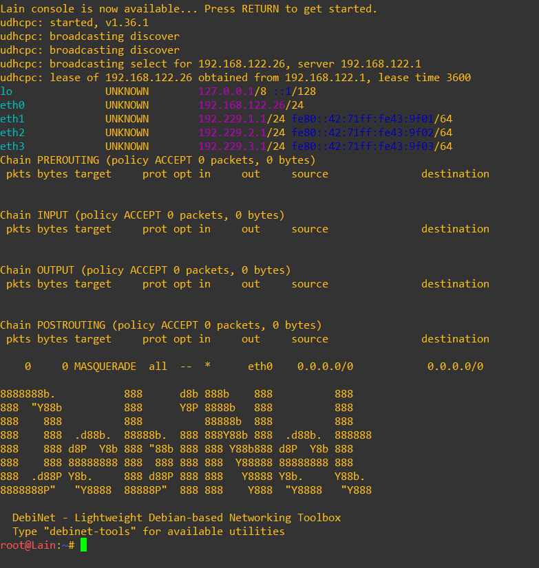

---

### Soal 6

Pada soal 6 diminta menjalankan traffic generator di node Mika, lalu sniffing pakai Wireshark dengan display filter khusus untuk paket DNS atau ICMP.

File generator diunduh dari link yang dikasih, isinya di-copas ke node Mika jadi `traffic_protocol7.sh`:

```sh
nano traffic_protocol7.sh
```

```sh
#!/bin/bash
# ============================================
# Traffic Generator — Protocol 7 Network
# Serial Experiments Lain — Modul 1 Jarkom 2026
# Jalankan di node MIKA untuk generate traffic DNS & ICMP
# ============================================

echo "============================================"
echo "  Protocol 7 Traffic Generator v2026"
echo "  Node: Mika Iwakura"
echo "============================================"
echo "[*] Generating DNS & ICMP traffic..."

# ICMP Traffic
ping -c 5 8.8.8.8 &
ping -c 5 1.1.1.1 &
ping -c 3 its.ac.id &

# DNS Queries
nslookup google.com 8.8.8.8 &
nslookup its.ac.id 8.8.8.8 &
nslookup github.com 1.1.1.1 &
dig @8.8.8.8 example.com A &
dig @1.1.1.1 cloudflare.com AAAA &

wait
echo "[*] Traffic generation complete."
echo "[*] Check Wireshark for captured packets."
```

```sh
chmod +x traffic_protocol7.sh
```

Script ini generate dua jenis traffic sekaligus secara paralel (pakai `&`), ICMP lewat `ping` ke beberapa target (8.8.8.8, 1.1.1.1, its.ac.id) dan DNS query lewat `nslookup` dan `dig` ke beberapa domain. Baris `wait` di akhir mastiin script nunggu semua proses background itu selesai dulu sebelum nampilin pesan selesai.

Sebelum script dijalankan, capture Wireshark di interface node Mika distart dulu, baru script dieksekusi:

```sh
./traffic_protocol7.sh
```

Setelah trafficnya kerekam, di Wireshark diterapin display filter:

```
dns or icmp
```

#### Output

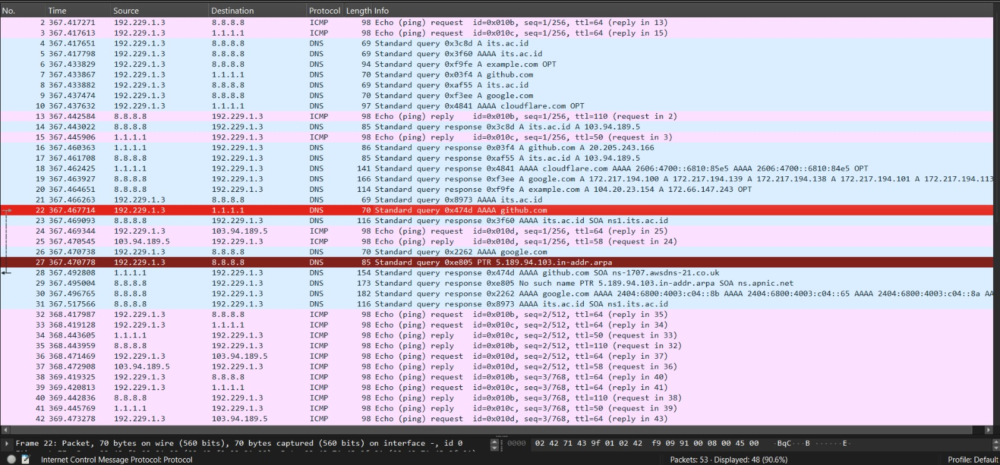

### Soal 7

Pada soal 7 Chisa mendirikan FTP Server dengan shared folder `/var/wired/data`. Kebijakan aksesnya, alice dapat read dan write, mika dibatasi read-only, eiri dibatasi tanpa izin akses sama sekali.

Bikin folder shared dulu:

```sh
mkdir -p /var/wired/data
chown root:root /var/wired/data
```

Bikin 3 user OS yang bakal jadi akun FTP:

```sh
adduser -D alice
adduser -D mika
adduser -D eiri
```

Install tools yang dibutuhin, termasuk `shadow` supaya `usermod` bisa dipakai:

```sh
apk update
apk add shadow
apk add vsftpd
```

Bikin grup akses khusus, alice dan mika dimasukin ke grup ini:

```sh
addgroup ftpaccess
adduser alice ftpaccess
adduser mika ftpaccess
```

Arahin home directory ketiga user ke folder shared:

```sh
usermod -d /var/wired/data alice
usermod -d /var/wired/data mika
usermod -d /var/wired/data eiri
```

```sh
chown root:ftpaccess /var/wired/data
chmod 770 /var/wired/data
```

Whitelist alice dan mika di userlist, otomatis eiri keblacklist karena gak masuk daftar:

```sh
echo -e "alice\nmika" > /etc/vsftpd.userlist
```

Setting read-only khusus buat mika:

```sh
mkdir -p /etc/vsftpd/user_conf
echo "write_enable=NO" > /etc/vsftpd/user_conf/mika
```

Isi `/etc/vsftpd.conf`:

```sh
listen=YES
anonymous_enable=NO
local_enable=YES
write_enable=YES
local_root=/var/wired/data
userlist_enable=YES
userlist_file=/etc/vsftpd.userlist
userlist_deny=NO
user_config_dir=/etc/vsftpd/user_conf
seccomp_sandbox=NO
pam_service_name=vsftpd
pasv_enable=YES
pasv_min_port=30000
pasv_max_port=30100
file_open_mode=0666
local_umask=002
```

Jalankan servernya:

```sh
vsftpd /etc/vsftpd.conf &
```

Hasil testing pakai lftp menunjukkan user alice bisa melakukan put, get, dan ls karena punya akses penuh, user mika bisa get tapi gagal put karena `write_enable=NO`, sedangkan user eiri gagal login sama sekali sehingga semua command tidak bisa dijalankan.

#### Output

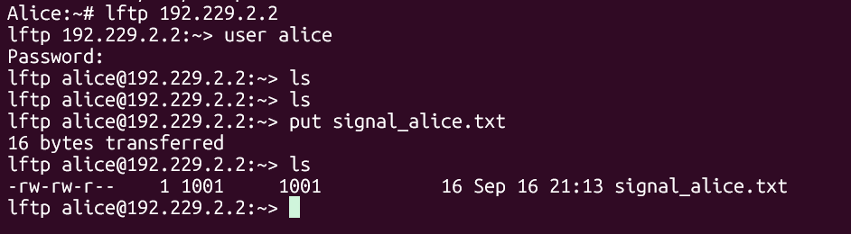
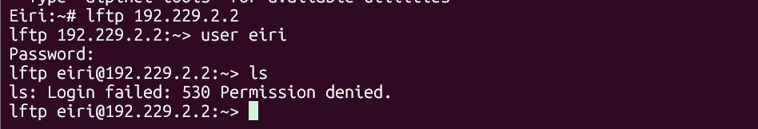
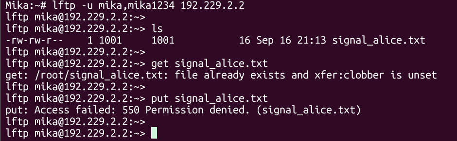

### Soal 8

Soal 8 minta Knights connect FTP ke server Chisa pakai akun alice buat upload dokumen, terus dianalisis di Wireshark: perintah STOR, status 226, dan port data PASV.

```sh
nano knights_report.txt
# isi file, copas dari drive
lftp alice@192.229.2.2
put knights_report.txt
```

Analisis dari Follow TCP Stream di Wireshark:

- Login: `USER alice` → `331 Please specify the password.` → `PASS ...` → `230 Login successful.`
- Mode binary: `TYPE I`
- Negosiasi PASV: request `PASV` → response `227 Entering Passive Mode (192.229.2.2,117,57)`, artinya port data = 117×256+57 = **30009** (masuk range `pasv_min_port`-`pasv_max_port` 30000-30100 yang udah diset di vsftpd.conf)
- Upload: `STOR knights_report.txt` → `226 Transfer complete.`

#### Output

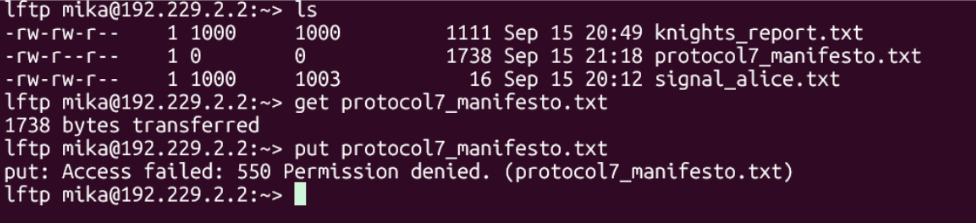

---

### Soal 9

Soal 9 minta Mika download `protocol7_manifesto.txt` pakai akun mika, terus buktiin read-only-nya jalan pas nyoba upload.

```
lftp mika@192.229.2.2:~> ls
-rw-rw-r--   1 1000     1000        1111 Sep 15 20:49 knights_report.txt
-rw-r--r--   1 0        0           1738 Sep 15 21:18 protocol7_manifesto.txt
-rw-rw-r--   1 1000     1003          16 Sep 15 20:12 signal_alice.txt
lftp mika@192.229.2.2:~> get protocol7_manifesto.txt
1738 bytes transferred
lftp mika@192.229.2.2:~> put protocol7_manifesto.txt
put: Access failed: 550 Permission denied. (protocol7_manifesto.txt)
```

Terbukti mika bisa `get` tapi kena `550 Permission denied` pas `put`, sesuai `write_enable=NO` yang khusus diset buat user mika.

---

### Soal 10

Soal 10 minta Knights ping ke Chisa buat uji latensi, payload 128 byte, interval 0.3 detik, sebanyak 77 paket.

```sh
ping -c 77 -s 128 -i 0.3 192.229.2.2
```

Di Wireshark, tiap Echo Request (ICMP Type 8, Code 0) dibales Echo Reply (ICMP Type 0, Code 0) dengan id dan seq yang sama, TTL request 63 dan reply 64 (beda karena lewat hop yang beda).

Hasil statistik:

.png>)

Gak ada packet loss (0%), RTT stabil di kisaran 0.4-1.06 ms, artinya koneksi ke server Chisa lancar.

#### Output

.png>)

---

### Kendala saat mengerjakan

- kesusahan dalam menemukan config yang tepat pada saat nomor 7
- kurang familiar untuk bagaimana setup gns yang bisa nyambung dengan wireshark terkait

### Soal 11

Buktikan kelemahan protokol Telnet dengan membuat akun phantom_user dan password wired_ghost pada layanan telnetd di node Chisa. Lakukan login Telnet dari node Eiri ke node Chisa dan tangkap sesi menggunakan Wireshark. Tunjukkan kredensial plain text melalui fitur Follow TCP Stream, serta jelaskan mengapa setiap karakter terkirim dalam paket TCP terpisah.

#### Topologi & Skenario

Simulasi mengacu pada studi kasus Serial Experiments Lain: Eiri (penyerang) mencoba mengakses layanan Telnet yang berjalan pada node Chisa menggunakan akun uji phantom_user. Traffic antara kedua node melewati Router (Lain) karena keduanya berada pada subnet/switch yang berbeda.

```
Node	Peran	IP :
Chisa	Telnet Server	192.229.2.2
Eiri	Telnet Client	192.229.3.3
```

#### Konfigurasi Server (Node Chisa)

Layanan telnetd diinstal menggunakan paket busybox-extras pada image Alpine (alpinet), dan akun pengujian dibuat menggunakan paket shadow:

```bash
apk update
apk add busybox-extras
apk add shadow
useradd -m phantom_user
echo "phantom_user:wired_ghost" | chpasswd
telnetd
```

Verifikasi service berjalan pada port 23:

```bash
netstat -tuln | grep 23
```

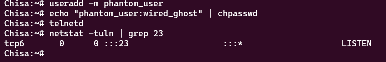

#### Persiapan Client (Node Eiri)

Paket busybox-extras diinstal untuk menyediakan Telnet client, kemudian dilakukan pengujian konektivitas dasar menggunakan ICMP sebelum melakukan koneksi Telnet:

```sh
ping -c 3 192.229.2.2
```

Hasil menunjukkan konektivitas jaringan berfungsi normal dengan 0% packet loss:

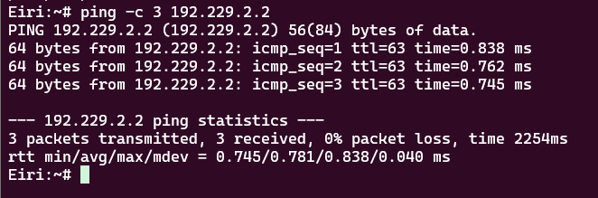

#### Proses Capture

Capture dilakukan menggunakan fitur Start capture pada link GNS3 yang menghubungkan Switch2–Chisa (eth0), sehingga seluruh traffic menuju node Chisa dapat ditangkap secara langsung sebelum sesi Telnet dimulai.

Setelah capture aktif, koneksi Telnet dijalankan dari node Eiri:

```sh
telnet 192.229.2.2
```

Login dilakukan menggunakan kredensial:

```
login: phantom_user
Password: wired_ghost
```

Hasil capture awal menunjukkan traffic dengan protokol TELNET terdeteksi otomatis oleh Wireshark, ditandai dengan banyaknya paket berukuran kecil (2–13 bytes) yang merepresentasikan pengiriman data per karakter, diselingi beberapa paket ARP (ARP Request/Reply) sebagai proses resolusi alamat MAC sebelum komunikasi TCP dimulai.

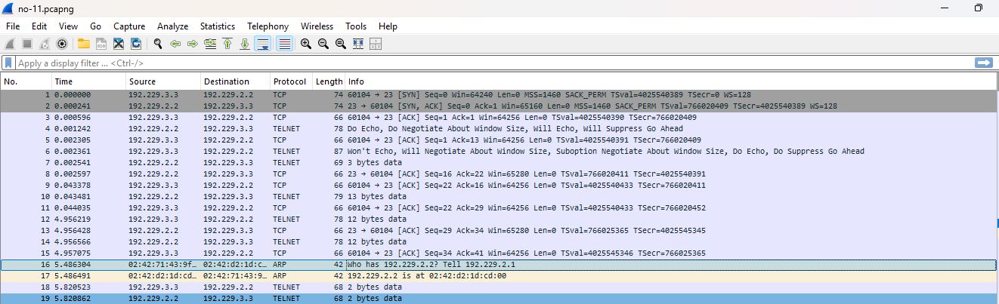

#### Penerapan Display Filter

Untuk memfokuskan analisis hanya pada sesi Telnet, diterapkan display filter:

`tcp.port == 23`

Filter berhasil menyaring 34 dari 36 paket total (94.4%), membuang 2 paket ARP yang tidak relevan dengan sesi Telnet.

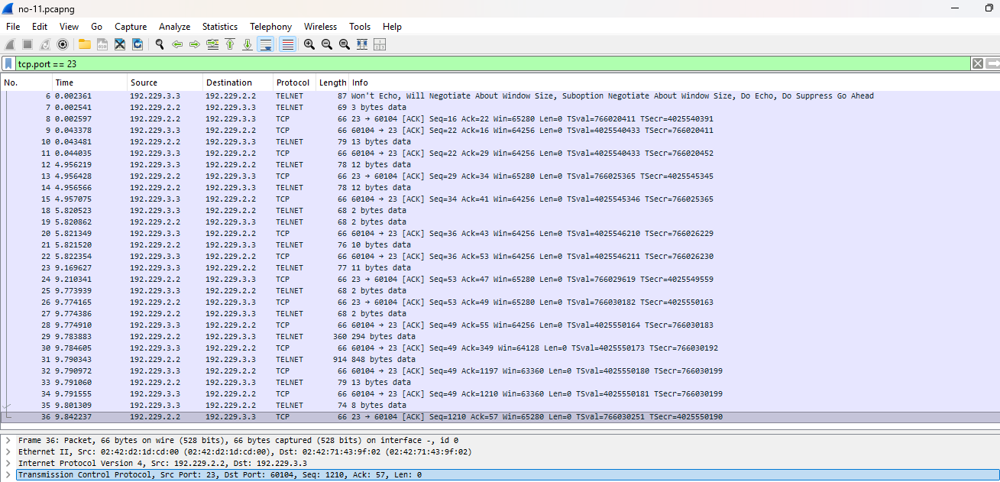

Pada tahap awal koneksi, terlihat proses negosiasi opsi Telnet (Telnet option negotiation) antara client dan server, seperti:

```
Do Echo, Do Negotiate About Window Size, Will Echo, Will Suppress Go Ahead
Won't Echo, Will Negotiate About Window Size, Do Suppress Go Ahead
```

Negosiasi ini merupakan bagian dari protokol Telnet untuk menyepakati mode terminal (echo, window size, dsb.) sebelum sesi interaktif dimulai.

#### Follow TCP Stream — Bukti Kredensial Plaintext

Untuk merekonstruksi keseluruhan isi sesi komunikasi, dilakukan `Follow → TCP Stream` pada salah satu paket TELNET. Hasil rekonstruksi menampilkan seluruh isi percakapan dalam bentuk teks yang mudah dibaca:

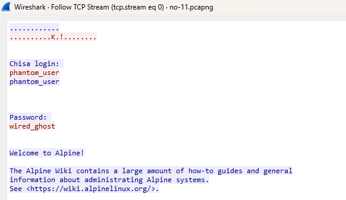

Dari hasil ini terbukti bahwa kredensial login (phantom_user dan wired_ghost) terkirim dalam bentuk plain text, dapat dibaca langsung tanpa proses dekripsi apapun oleh siapa pun yang mampu menyadap traffic jaringan.

#### Analisis: Mengapa tiap Karakter Terkirim dalam Paket TCP Terpisah

Berdasarkan pengamatan pada Packet List, terlihat pola paket-paket kecil (payload 1–2 byte) yang dikirim berurutan alih-alih satu paket besar berisi seluruh kata. Hal ini disebabkan oleh karakteristik operasional protokol Telnet:

- Character Mode (bukan Line Mode) : Telnet secara default beroperasi dalam mode karakter, di mana setiap penekanan tombol oleh user langsung dikirimkan ke server secara individual tanpa menunggu buffer baris penuh atau tombol Enter ditekan.
- Tidak Ada Local Echo : Karena client tidak menampilkan karakter secara lokal, server harus melakukan remote echo dengan mengirim balik setiap karakter yang diterima agar dapat ditampilkan di layar client. Hal ini menghasilkan traffic dua arah untuk setiap karakter (client→server, lalu server→client).
- Tidak Ada Negosiasi Line Buffering : Opsi LINEMODE yang memungkinkan pengiriman per-baris jarang diaktifkan pada implementasi Telnet sederhana seperti telnetd bawaan BusyBox, sehingga default yang digunakan tetap character-by-character.

Akibatnya, kata seperti phantom_user (12 karakter) menghasilkan setidaknya 12 paket kirim + 12 paket echo balik, yang terlihat jelas sebagai rangkaian paket kecil berurutan pada Packet List Wireshark.

Temuan ini menegaskan bahwa protokol Telnet tidak layak digunakan pada jaringan produksi atau jaringan yang tidak sepenuhnya terpercaya, dan sebaiknya digantikan dengan protokol yang mengenkripsi seluruh sesi komunikasi seperti SSH.

### Soal 12

Alice mencurigai Knights menjalankan beberapa layanan rahasia di node-nya. Lakukan pemindaian port dari node Alice ke node Knights menggunakan Netcat (nc) untuk memeriksa port 22 (SSH) dan 80 (HTTP) dalam keadaan terbuka, serta port rahasia 7777 dalam keadaan tertutup. Analisis di Wireshark perbedaan TCP Flag yang dikembalikan antara port terbuka (SYN-ACK) dengan port tertutup (RST-ACK).

#### Topologi & Skenario

Simulasi mengacu pada studi kasus _Serial Experiments Lain_: Alice mencurigai adanya layanan tersembunyi pada node Knights, lalu melakukan pemindaian terhadap tiga port sekaligus: dua port umum (SSH/HTTP) dan satu port rahasia.

| Node    | Peran                | IP          |
| ------- | -------------------- | ----------- |
| Knights | Target scan          | 192.229.3.2 |
| Alice   | Penyerang / pemindai | 192.229.1.2 |

#### Konfigurasi Target (Node Knights)

Dua listener disiapkan menggunakan `netcat-openbsd` untuk mensimulasikan port dalam keadaan terbuka pada port 22 dan 80, sementara port 7777 sengaja dibiarkan tanpa proses apapun agar tetap tertutup:

```bash
apk update
apk add netcat-openbsd

nc -lk -p 22 &
nc -lk -p 80 &
```

Verifikasi kedua listener aktif:

```bash
netstat -tuln | grep -E '22|80'
```

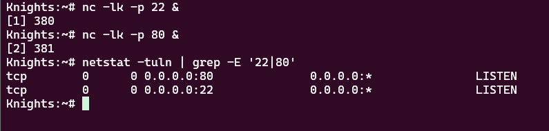

Port 7777 tidak dikonfigurasi apapun, sehingga secara default berada dalam keadaan tertutup di level kernel.

#### Persiapan Alat Pemindai (Node Alice)

```bash
apk update
apk add netcat-openbsd
```

#### Proses Capture

Capture diaktifkan pada link GNS3 yang menghubungkan node Knights ke switch-nya, dilakukan **sebelum** proses scanning dijalankan agar seluruh proses handshake dapat tertangkap sepenuhnya.

#### Eksekusi Port Scan

Dari node Alice, dilakukan pemindaian terhadap ketiga port menggunakan Netcat dengan opsi `-vz` (verbose, zero-I/O mode):

```bash
nc -vz 192.229.3.2 22
nc -vz 192.229.3.2 80
nc -vz 192.229.3.2 7777
```

Hasil eksekusi:
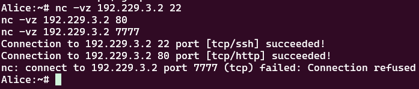

Hasil menunjukkan port 22 dan 80 berada dalam status **terbuka** (`succeeded`), sedangkan port 7777 berada dalam status **tertutup** (`Connection refused`), sesuai dengan konfigurasi yang telah dipersiapkan pada node Knights.

#### Analisis pada Wireshark

Capture dihentikan setelah proses scanning selesai, kemudian disimpan sebagai `no-12.pcapng`. Display filter diterapkan untuk memfokuskan analisis pada ketiga port yang diuji:

```
tcp.port == 22 or tcp.port == 80 or tcp.port == 7777
```

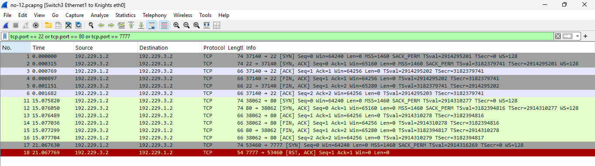

**Untuk port 22 dan 80 (kondisi terbuka),** rangkaian paket menunjukkan proses TCP three-way handshake yang berhasil diselesaikan:

```
Alice   → Knights   [SYN]
Knights → Alice     [SYN, ACK]
Alice   → Knights   [ACK]
```

diikuti dengan paket `[FIN, ACK]` karena mode `-z` pada Netcat langsung menutup koneksi setelah verifikasi konektivitas berhasil.

**Untuk port 7777 (kondisi tertutup),** handshake tidak pernah selesai. Paket yang terekam hanya:

```
Alice   → Knights   [SYN]
Knights → Alice     [RST, ACK]
```


#### Perbandingan TCP Flag

| Kondisi Port     | Flag yang Diterima | Penjelasan                                                                                                                                                         |
| ---------------- | ------------------ | ------------------------------------------------------------------------------------------------------------------------------------------------------------------ |
| Terbuka (22, 80) | `SYN, ACK`         | Terdapat proses (listener) yang bind ke port tersebut dan bersedia menerima koneksi, sehingga kernel merespons dengan melanjutkan proses handshake                 |
| Tertutup (7777)  | `RST, ACK`         | Tidak ada proses yang listen pada port tersebut, sehingga kernel segera menolak permintaan koneksi dengan mengirimkan flag reset (RST) tanpa melanjutkan handshake |

### Soal 13

Lain memerintahkan agar administrasi jarak jauh menggunakan SSH secara aman tanpa password. Install OpenSSH server pada node Knights, buat pasangan kunci SSH (ssh-keygen) pada node Mika untuk user mika_admin, dan konfigurasikan public key authentication (PasswordAuthentication no). Lakukan koneksi SSH dari node Mika ke node Knights, tangkap sesi menggunakan Wireshark, identifikasi paket Protocol Version Exchange dan Key Exchange, serta jelaskan mengapa kredensial tidak terlihat dalam bentuk teks terbuka seperti pada Telnet.

#### Topologi & Skenario

Simulasi mengacu pada studi kasus Serial Experiments Lain: Lain memerintahkan agar administrasi jarak jauh dilakukan secara aman. OpenSSH server diinstal pada node Knights, sementara node Mika bertindak sebagai client yang melakukan koneksi menggunakan keypair SSH atas nama user mika_admin.

Node Peran IP

```
Knights	SSH Server	192.229.3.2
Mika	SSH Client (user: mika_admin)	192.229.1.3
```

#### Instalasi dan Konfigurasi SSH Server (Node Knights)

```bash
apk update
apk add openssh
ssh-keygen -A
passwd root
/usr/sbin/sshd
```

Verifikasi service berjalan pada port 22:

```bash
netstat -tuln | grep 22
tcp        0      0 0.0.0.0:22              0.0.0.0:*               LISTEN
tcp6       0      0 :::22                   :::*                    LISTEN
```

Konfigurasi `/etc/ssh/sshd_config` diatur sebagai berikut untuk mengaktifkan autentikasi berbasis public key:

```conf
PermitRootLogin yes
PubkeyAuthentication yes
PasswordAuthentication no
```

#### Generate Keypair SSH (Node Mika)

Instalasi SSH client dan pembuatan user khusus:

```bash
apk add openssh-client shadow
useradd -m mika_admin
passwd mika_admin
su - mika_admin
```

Generate RSA keypair 2048-bit:

```bash
ssh-keygen -t rsa -b 2048
```

Hasil:

```
Your identification has been saved in /home/mika_admin/.ssh/id_rsa
Your public key has been saved in /home/mika_admin/.ssh/id_rsa.pub
The key fingerprint is:
SHA256:Iojs0aNTCqtaoHkiC7YDPPKYLFeAeEGLfs/SAkf3liE mika_admin@Mika
```

#### Distribusi Public Key ke Server

Isi public key ditampilkan di Mika:

```bash
cat ~/.ssh/id_rsa.pub
```

Kemudian ditambahkan secara manual ke file `authorized_keys` pada node Knights:

```bash
mkdir -p /root/.ssh
nano /root/.ssh/authorized_keys    # paste isi public key
chmod 700 /root/.ssh
chmod 600 /root/.ssh/authorized_keys
```

#### Proses Capture dan Koneksi SSH

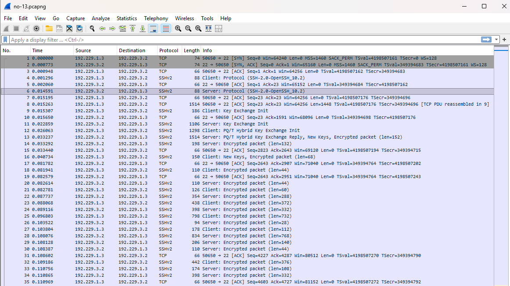

Capture dimulai pada link antara Switch1–Mika (eth0) sebelum koneksi SSH dijalankan, untuk memastikan seluruh fase handshake tertangkap. Koneksi dilakukan dari user mika_admin di Mika:

```bash
ssh -v root@192.229.3.2
```

Koneksi berhasil dan langsung masuk ke shell Knights tanpa diminta password sama sekali, membuktikan autentikasi berbasis public key berfungsi dengan benar.

#### Analisis Wireshark

Display filter yang digunakan:

`tcp.port==22`

Hasil capture menunjukkan urutan lengkap fase komunikasi SSH sebagai berikut:

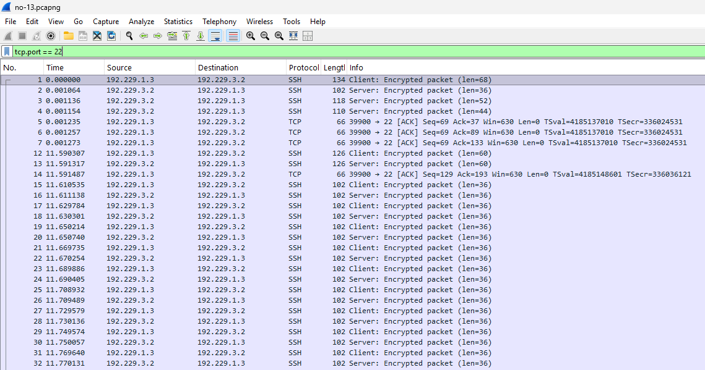

##### 13.1 Identifikasi Protocol Version Exchange

Paket No. 6 (Server: Protocol) di-expand pada bagian SSH Protocol, menampilkan isi plaintext:

```Protocol: SSH-2.0-OpenSSH_10.2
[Direction: Server to Client]
```

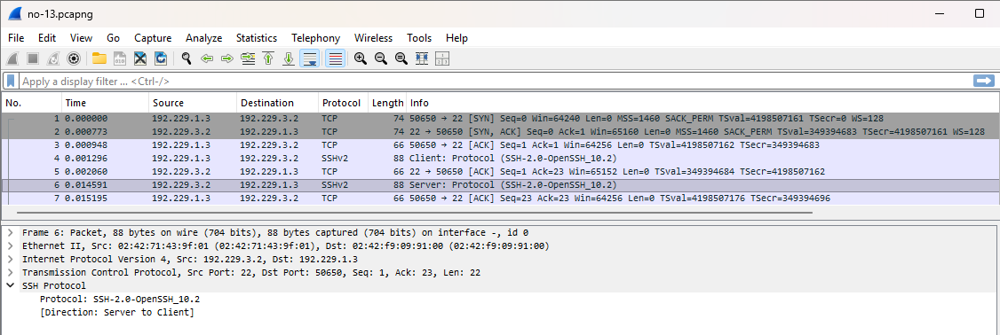
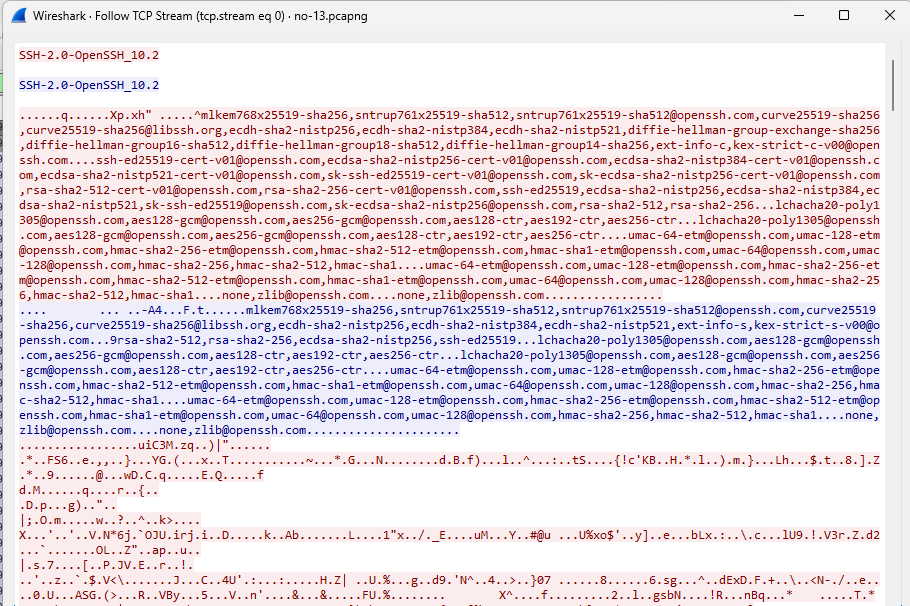

Ini adalah satu-satunya bagian dari sesi SSH yang dikirim dalam bentuk plaintext, karena kedua pihak perlu saling mengetahui versi protokol yang didukung sebelum proses enkripsi dapat dinegosiasikan.

##### 13.2 Identifikasi Key Exchange

Pada paket No. 9, 11 dan 12 terlihat proses negosiasi algoritma kriptografi (Key Exchange Init), dilanjutkan dengan PQ/T Hybrid Key Exchange, sebuah skema Diffie-Hellman modern yang menggabungkan algoritma tradisional dengan algoritma tahan-kuantum (post-quantum) untuk keamanan tambahan terhadap ancaman komputasi kuantum di masa depan.

Setelah paket "New Keys" pada No. 13, seluruh komunikasi berikutnya (termasuk proses autentikasi user) berubah menjadi Encrypted packet yang tidak dapat dibaca isinya sama sekali oleh pihak ketiga.

#### Perbandingan dengan Telnet

| Aspek                 | Telnet                                                      | SSH                                               |
| --------------------- | ----------------------------------------------------------- | ------------------------------------------------- |
| Kredensial saat login | Plaintext, terbaca langsung (`phantom_user`, `wired_ghost`) | Tidak pernah dikirim, private key tetap di client |
| Isi sesi komunikasi   | Seluruhnya plaintext                                        | Terenkripsi setelah Key Exchange                  |
| Follow TCP Stream     | Menampilkan teks percakapan lengkap                         | Menampilkan data biner/acak (tidak terbaca)       |
| Bagian yang plaintext | Seluruh sesi                                                | Hanya Protocol Version Exchange                   |

#### Analisis

Kredensial Tidak Terlihat Plaintext seperti Telnet Key Exchange (Diffie-Hellman Hybrid) dilakukan di awal sesi untuk menyepakati session key rahasia antara client dan server, tanpa pernah mengirim kunci privat melalui jaringan, kedua pihak menghitung shared secret yang sama secara independen berdasarkan pertukaran nilai publik.
Setelah Key Exchange selesai (ditandai paket "New Keys"), seluruh komunikasi berikutnya dienkripsi menggunakan algoritma simetris yang telah disepakati.

Karena autentikasi menggunakan public key, private key milik mika_admin tidak pernah dikirim melalui jaringan sama sekali. Proses yang terjadi adalah server mengirimkan challenge yang harus ditandatangani secara digital oleh private key di sisi client, dan hanya hasil tanda tangan (signature) tersebut yang dikirim balik ke server untuk diverifikasi menggunakan public key yang telah terdaftar di authorized_keys.
Hal ini kontras total dengan Telnet, yang mengirimkan setiap karakter kredensial secara langsung tanpa perlindungan enkripsi apapun.Pengujian ini membuktikan bahwa SSH dengan autentikasi berbasis public key memberikan tingkat keamanan jauh lebih tinggi dibandingkan Telnet.

### Soal 14

Setelah gagal mengakses FTP, Eiri melancarkan serangan brute-force terhadap form login web Alice. Analisis file capture wired_bruteforce.pcapng untuk mengidentifikasi alamat IP penyerang, target IP beserta port yang diserang, password user lain_admin yang berhasil ditembus, serta web server software dan versi yang dilaporkan pada response header. Validasi temuan kalian pada socket server:
([link file](https://drive.google.com/drive/folders/1-MloxOyGauBYglc6TKTQ84VeILvJjjG2?usp=sharing)) nc [IP_Group] 3401

#### Metodologi Analisis

File capture dibuka langsung di Wireshark tanpa proses live capture (analisis forensik post-mortem). Tahapan analisis:

a. Identifikasi paket awal untuk menentukan IP dan port yang terlibat

Pemeriksaan pada salah satu paket TCP menunjukkan:

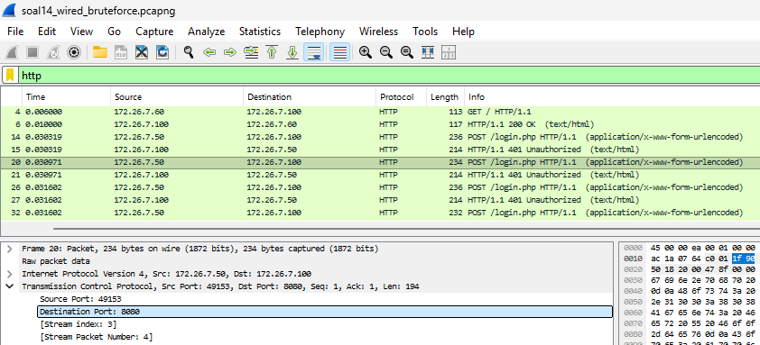

b. Penerapan filter untuk fokus pada response HTTP

`http.response`

Hasil filter menampilkan ratusan baris response dengan pola dominan:

`172.26.7.100 → 172.26.7.50    HTTP/1.1 401 Unauthorized  (text/html)`

Pola ini konsisten dengan karakteristik serangan brute-force, di mana penyerang melakukan percobaan login berulang kali dan menerima penolakan pada setiap percobaan yang gagal.

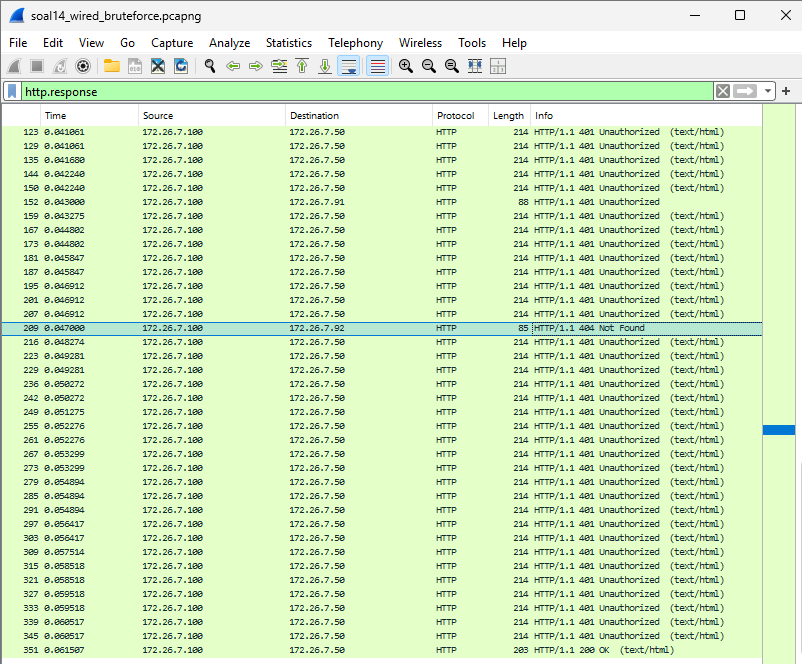

c. Identifikasi response yang menandakan keberhasilan

Di antara ratusan response 401 Unauthorized, ditemukan satu paket (No. 351) dengan status berbeda:

`172.26.7.100 → 172.26.7.50    HTTP/1.1 200 OK  (text/html)`

Response 200 OK ini mengindikasikan bahwa percobaan login pada titik tersebut berhasil diterima oleh server, berbeda dari mayoritas percobaan sebelumnya yang ditolak.

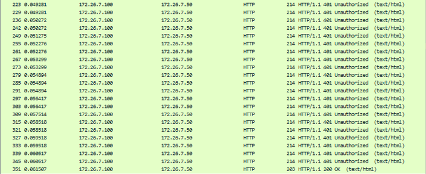

d. Identifikasi payload request yang menyebabkan keberhasilan

Paket request tepat sebelum response sukses (No. 350) diperiksa pada bagian HTML Form URL Encoded:

`POST /login.php HTTP/1.1  (application/x-www-form-urlencoded)`

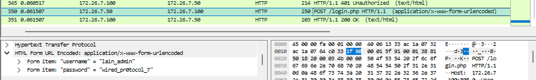

#### Hasil Temuan

| Item                            | Nilai              |
| ------------------------------- | ------------------ |
| Alamat IP Penyerang             | 172.26.7.50        |
| Alamat IP Target (Korban)       | 172.26.7.100       |
| Port yang diserang              | 8080               |
| Endpoint yang diserang          | `/login.php`       |
| Username yang berhasil ditembus | `lain_admin`       |
| Password yang berhasil ditembus | `wired_pr0tocol_7` |

#### Identifikasi Web Server Software

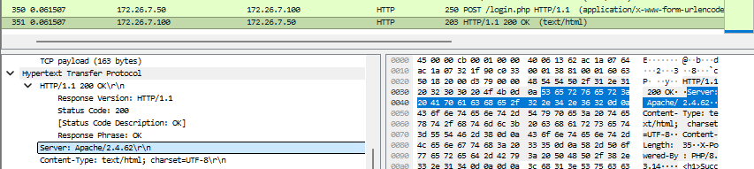

#### Validasi Temuan

Temuan divalidasi melalui socket server sesuai instruksi soal:

```bash
nc 10.4.89.246 3401
```

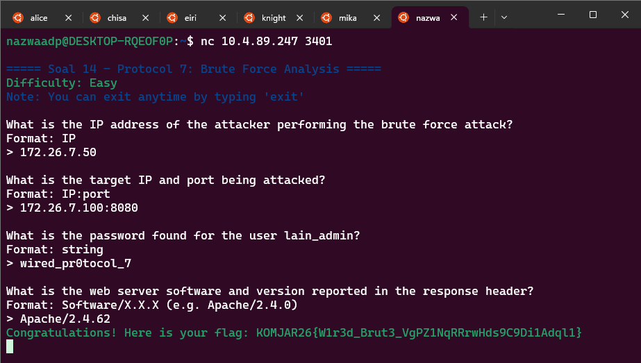

#### Kesimpulan

Analisis forensik terhadap file wired_bruteforce.pcapng berhasil mengungkap pola serangan brute-force yang ditandai dengan ratusan percobaan login berulang (response 401 Unauthorized) yang berasal dari satu alamat IP penyerang (172.26.7.50) terhadap satu target (172.26.7.100:8080). Percobaan ke-N akhirnya berhasil menembus autentikasi dengan kredensial lain_admin/wired_protocol_7, ditandai dengan perubahan response menjadi 200 OK. Teknik identifikasi ini mencari anomali status code di antara pola response yang seragam dimana hl ini merupakan pendekatan forensik dasar yang efektif untuk mendeteksi serangan brute-force pada traffic HTTP.

### Soal 15

Eiri menyusup ke ruang server dan memasang perangkat keyboard USB berbahaya pada node Alice. Buka file capture wired_usb_hid.pcap, identifikasi Vendor ID dan Product ID perangkat USB dari deskriptor USB, alamat nomor device USB, serta pesan rahasia yang berhasil dicuri dari keystroke. Validasi temuan kalian pada socket server:
([link file](https://drive.google.com/drive/folders/1oAPzN9IEN0264_LlvGnl_CsIiYh-Hp8w?usp=drive_link)) nc [IP_Group] 3402

#### Metodologi Analisis

**a. Membuka file capture**
File `wired_usb_hid.pcap` dibuka langsung di Wireshark tanpa proses live capture.

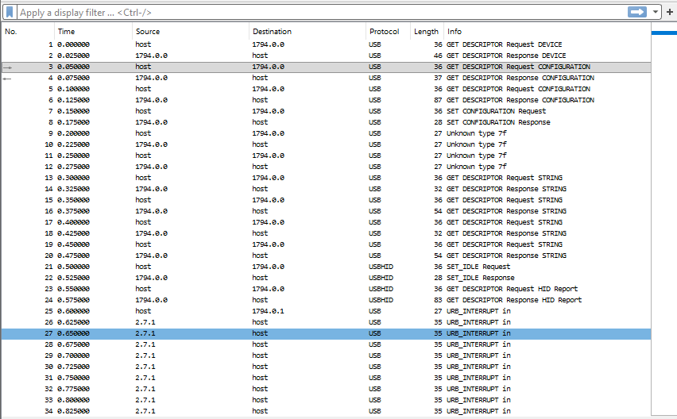

**b. Identifikasi Vendor ID dan Product ID**

Filter yang digunakan:

```
usb
```

Paket dengan Info **"GET DESCRIPTOR Response DEVICE"** diperiksa pada bagian **USB Device Descriptor** di Packet Details, menampilkan:

```
idVendor: 0x____
idProduct: 0x____
```

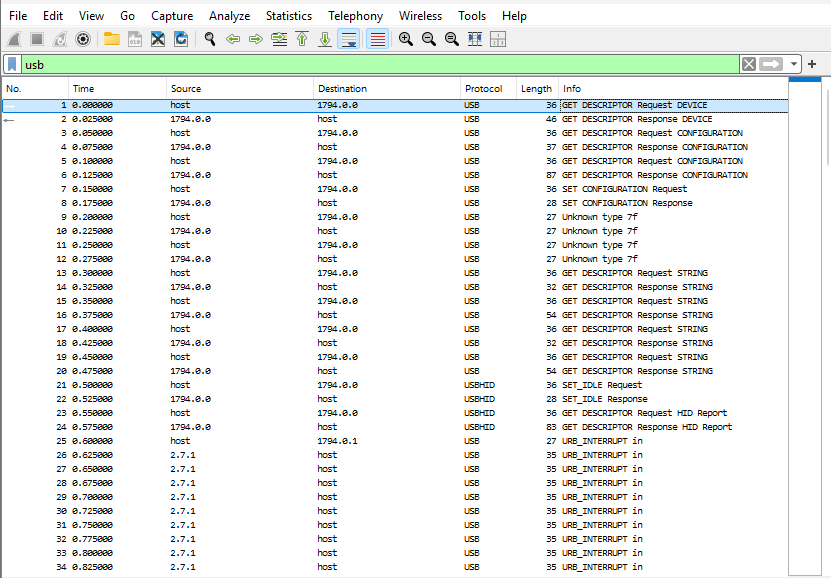
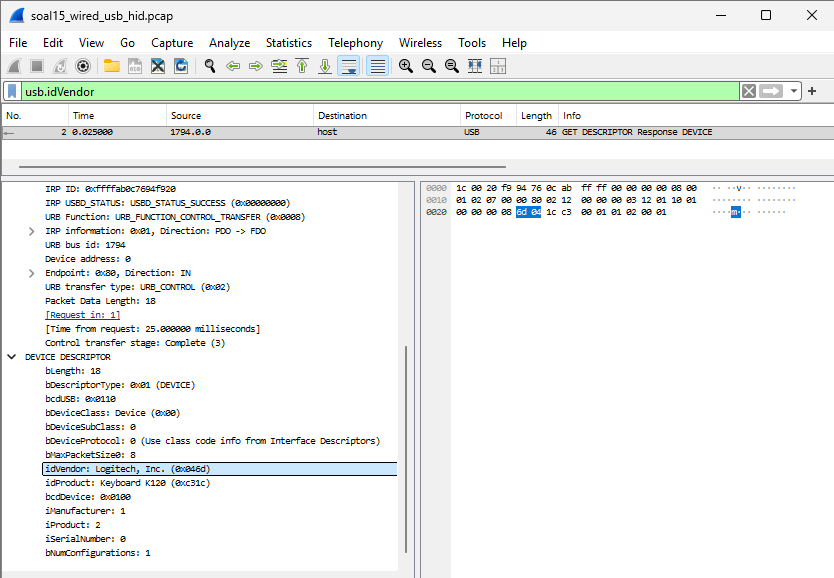

**c. Identifikasi alamat nomor device USB**

Nomor device diperoleh dari field **Device** pada URB (USB Request Block) header di Packet Details paket-paket USB yang terkait.

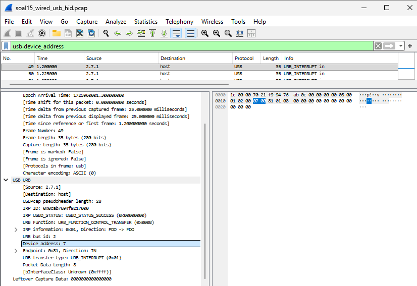

**d. Rekonstruksi pesan rahasia dari keystroke**

Filter digunakan untuk menyaring paket data HID:

```
usb.capdata
```

Setiap paket data HID keyboard terdiri dari 8 byte, dengan byte pertama sebagai modifier key dan byte ketiga dan seterusnya berisi kode HID Usage ID untuk tombol yang ditekan. Setiap kode HID diterjemahkan satu per satu menggunakan tabel referensi **USB HID Keyboard Usage ID** untuk menyusun pesan lengkap.

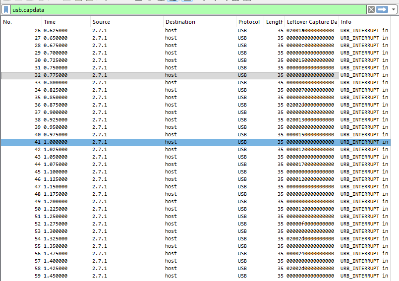
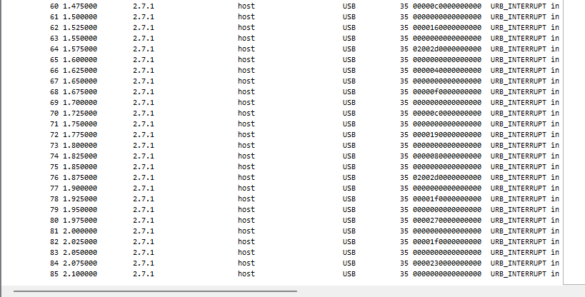

#### Hasil Temuan

| Item                          | Nilai                            |
| ----------------------------- | -------------------------------- |
| Vendor ID (idVendor)          | ` 0x046d`                        |
| Product ID (idProduct)        | `0xc31c`                         |
| Alamat nomor device USB       | `7`                              |
| Pesan rahasia hasil keystroke | `Wired_Protocol_7_is_alive_2026` |

#### Validasi Temuan

```bash
nc 10.4.89.246 3402
```

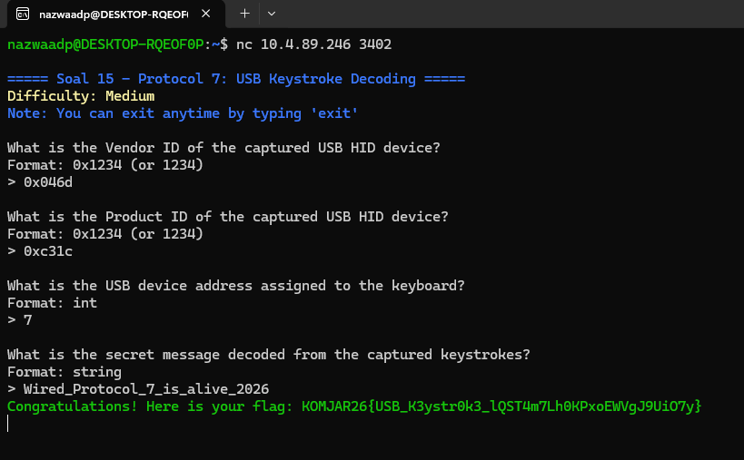

#### Kesimpulan

Analisis forensik pada file `wired_usb_hid.pcap` membuktikan bahwa serangan _keystroke injection_ melalui perangkat USB HID palsu dapat diidentifikasi dan direkonstruksi secara lengkap dari lalu lintas USB yang tercatat, meskipun tidak melibatkan komunikasi jaringan konvensional. Identifikasi Vendor ID dan Product ID juga memungkinkan pelacakan jenis perangkat fisik yang digunakan penyerang.

### Soal 16

Eiri meletakkan file malware di server. Dari file capture wired_ftp_theft.pcap, lakukan analisis lalu lintas FTP untuk mengidentifikasi alamat IP server FTP penyerang, banner software FTP yang digunakan, kredensial login penyerang, serta ukuran (size in bytes) dari file malware knights_payload.exe yang diunduh. Validasi temuan kalian pada socket server:
([link file](https://drive.google.com/drive/folders/1qBeAXVx1MG14L0jzGefqs3t8qO8VRMmb?usp=sharing)) nc [IP_Group] 3403

#### Metodologi Analisis

**a. Identifikasi banner server FTP**

Filter:

```
ftp
```

Paket pertama dari server (response awal koneksi) diperiksa pada kolom Info:

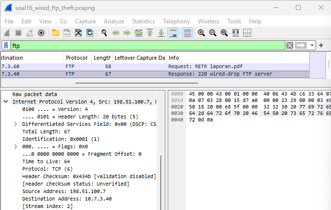
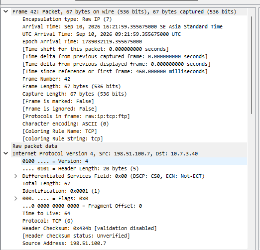

**b. Identifikasi kredensial login**

Ditemukan dari `Follow TCP Stream` :

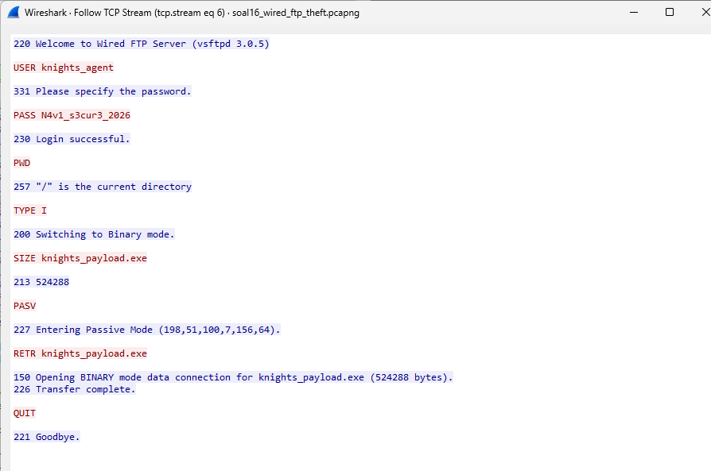

**c. Identifikasi ukuran file malware**

Filter diubah ke:

```
ftp-data
```

Ukuran file ditemukan melalui layar yang sama dengan sebelumnya dab dilihat di kolom **Bytes** sebagai ukuran total file `knights_payload.exe` yang ditransfer.

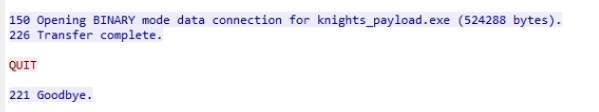

#### Hasil Temuan

| Item                                 | Nilai                                |
| ------------------------------------ | ------------------------------------ |
| IP Server FTP Penyerang              | `198.51.100.7`                       |
| Banner software FTP                  | `Wired FTP Server (vsftpd 3.0.5)`    |
| Kredensial login (username/password) | `knights_agent` / `N4v1_s3cur3_2026` |
| Ukuran file `knights_payload.exe`    | `524288 bytes`                       |

#### Validasi Temuan

```bash
nc 10.4.89.246 3403
```

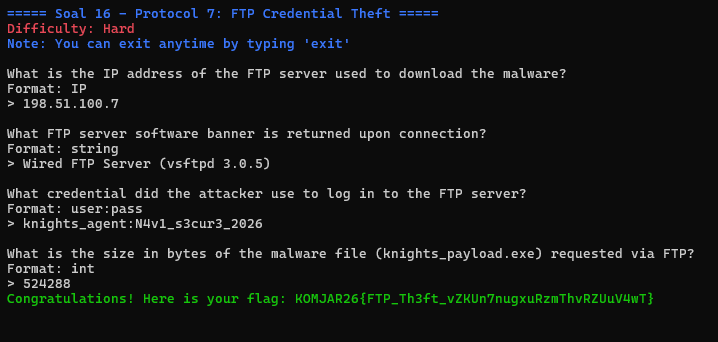

#### Kesimpulan

Protokol FTP yang tidak terenkripsi memungkinkan seluruh proses autentikasi maupun aktivitas transfer file, termasuk file malware yang dapat diamati secara penuh melalui analisis packet capture, meliputi identitas server, kredensial yang digunakan, hingga ukuran payload yang diunduh oleh korban.

### Soal 17

Alice membuat halaman web di node-nya. Eiri memanfaatkan celah untuk mengunduh payload berbahaya ke sistem Alice. Analisis file capture wired_http_c2.pcap untuk mengidentifikasi nama domain (Host) tempat malware diunduh, alamat IP server penyerang, nama file executable malware yang diunduh, serta kode status HTTP yang dikembalikan. Validasi temuan kalian pada socket server:
([link file](https://drive.google.com/drive/folders/1iPYESj5AN-uXYXfD2Wo2cRrm_Rigr_D6?usp=sharing)) nc [IP_Group] 3404

#### Metodologi Analisis

**a. Identifikasi request pengunduhan**

Filter:

```
http
```

Paket **GET request** diperiksa pada bagian **Hypertext Transfer Protocol** di Packet Details, meliputi:

```
Host: wired-update.net\r\n
GET /navi_agent.exe HTTP/1.1\r\n
```

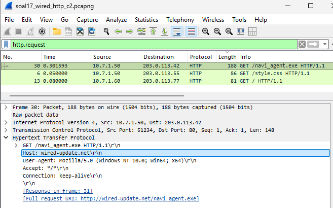

**b. Identifikasi response server**

Paket response dari server diperiksa pada kolom Info:

```
HTTP/1.1 200 OK
```

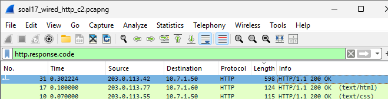

**c. Identifikasi IP server penyerang**

Diambil dari packet detail.

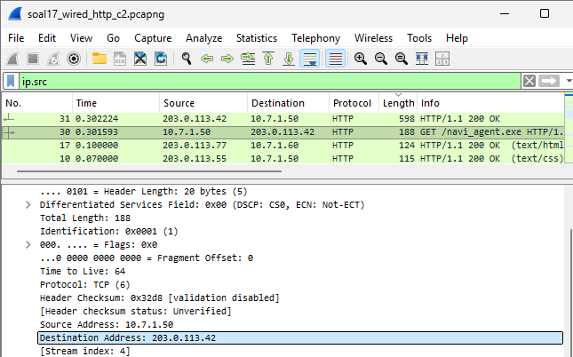

#### Hasil Temuan

| Item                         | Nilai              |
| ---------------------------- | ------------------ |
| Nama domain (Host)           | `wired-update.net` |
| Alamat IP server penyerang   | `203.0.113.42`     |
| Nama file executable malware | `navi_agent.exe`   |
| Kode status HTTP             | `200`              |

#### Validasi Temuan

```bash
nc 10.4.89.246 3404
```

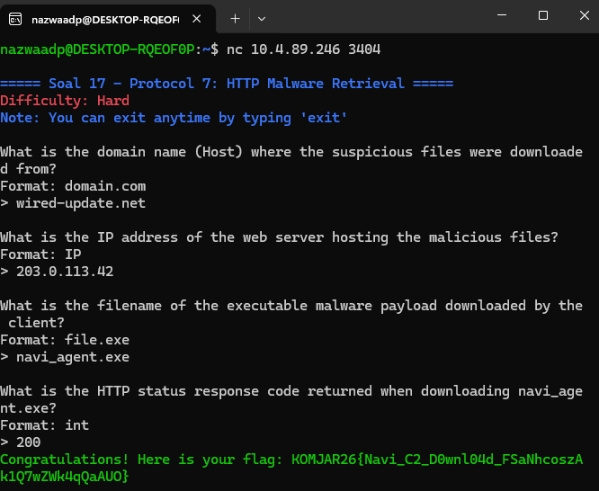

#### Kesimpulan

Traffic HTTP yang tidak terenkripsi memungkinkan seluruh detail proses download malware. Mulai dari domain sumber, path file, hingga status keberhasilan unduhan dapat direkonstruksi sepenuhnya melalui analisis packet capture tanpa memerlukan proses dekripsi tambahan.

### Soal 18

Eiri mengubah taktik penyerangan dengan menanamkan file malware menggunakan protokol file sharing SMB. Analisis file capture wired_smb_transfer.pcapng untuk mengidentifikasi nama protokol jaringan yang dieksploitasi, IP pengirim dan penerima, folder tujuan penyimpanan malware pada sistem korban, serta nama file executable malware yang ditransfer. Validasi temuan kalian pada socket server:
([link file](https://drive.google.com/file/d/1XBtKWtNM_RrSBTp2e3O5vBdiklcPNsKs/view?usp=sharing)) nc [IP_Group] 3405

#### Metodologi Analisis

**a. Identifikasi protokol dan share yang diakses**

Filter:

```
smb2
```

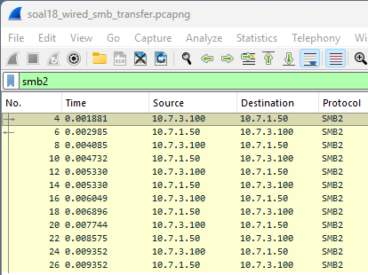

**b. Identifikasi nama file dan folder tujuan**

Paket dengan Info **"Write Request"** diperiksa untuk melihat nama file yang dibuat/dibuka pada sistem korban.

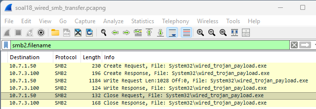

**c. Identifikasi IP pengirim dan penerima**

Diambil dari field **Source** dan **Destination** pada paket-paket SMB terkait.

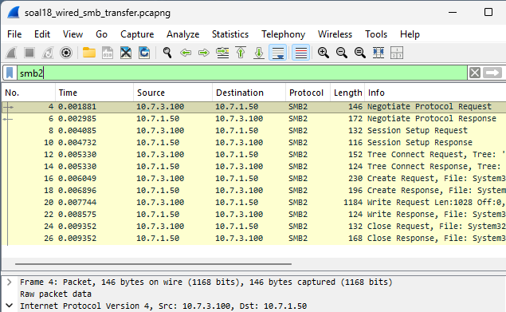

#### Hasil Temuan

| Item                         | Nilai                      |
| ---------------------------- | -------------------------- |
| Protokol yang dieksploitasi  | SMB2                       |
| IP Pengirim                  | `10.7.3.100`               |
| IP Penerima                  | `10.7.1.50`                |
| Folder tujuan penyimpanan    | `system32`                 |
| Nama file executable malware | `wired_trojan_payload.exe` |

#### Validasi Temuan

```bash
nc 10.4.89.246 3405
```

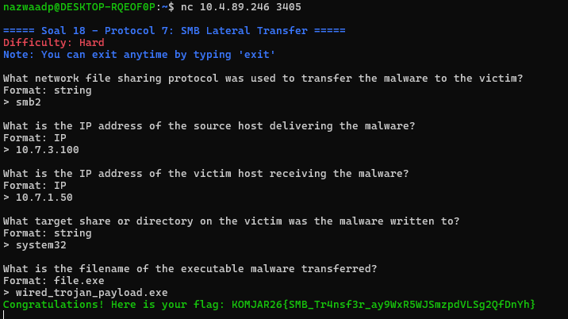

#### Kesimpulan

Protokol SMB, yang umum digunakan untuk berbagi file dalam jaringan lokal, dapat dimanfaatkan sebagai vektor distribusi malware apabila tidak diamankan dengan baik. Analisis packet capture menunjukkan bahwa seluruh proses transfer file, mulai dari koneksi ke share, pembuatan file, hingga penulisan data dapat direkonstruksi secara lengkap.

### Soal 19

Eiri meneror jaringan dengan mengirimkan email pemerasan melalui protokol SMTP tanpa enkripsi. Analisis file capture wired_smtp_threat.pcap pada stream TCP terkait, identifikasi alamat email korban yang ditargetkan, password korban yang diklaim bocor oleh penyerang, jenis malware yang diinfeksikan, batas waktu (dalam hari) yang diberikan, serta MailClientID yang tercantum pada pesan. Validasi temuan kalian pada socket server: ([link file](https://drive.google.com/drive/folders/1RAW0cMoGDDStPyFHeJ_0t9kkoLGBsCmH?usp=sharing)) nc [IP_Group] 3406

#### Metodologi Analisis

**a. Identifikasi sesi SMTP**

Filter:

```
smtp
```

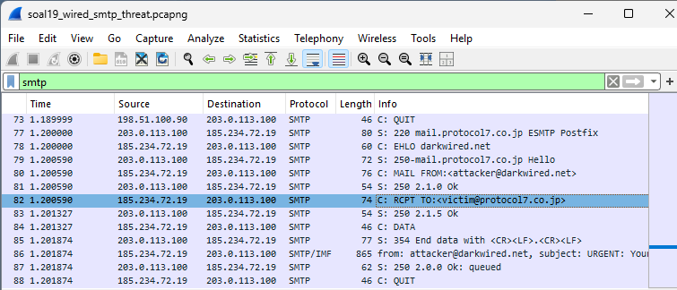

Dicari koneksi TCP yang mengandung perintah `DATA`, menandakan dimulainya pengiriman isi (body) email.

**b. Rekonstruksi isi email**

Klik kanan pada salah satu paket dalam TCP stream tersebut, pilih **Follow → TCP Stream**, untuk membaca keseluruhan isi email secara lengkap dalam format yang mudah dibaca.

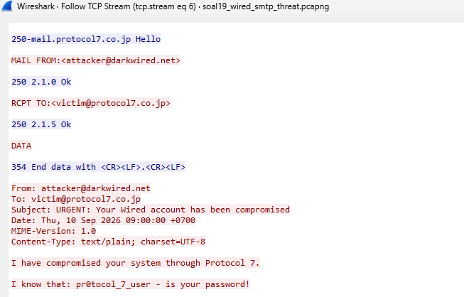

**c. Identifikasi detail isi email**

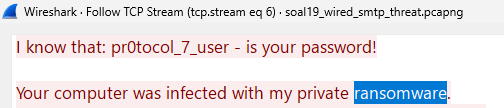

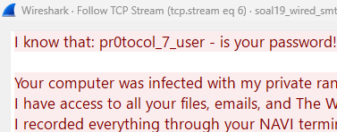

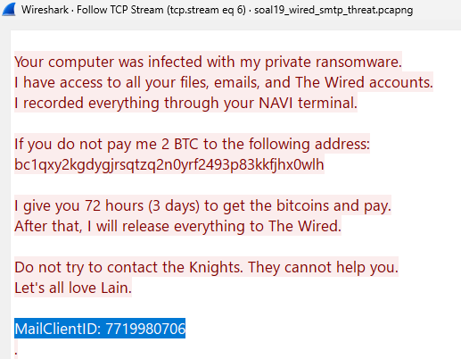

Dari hasil Follow TCP Stream, diidentifikasi:

- Alamat email tujuan pada header `To:`
- Klaim password yang bocor dalam isi pesan
- Jenis malware yang disebutkan
- Batas waktu (dalam hari) yang diberikan
- Header kustom `MailClientID:`

#### Hasil Temuan

| Item                            | Nilai                    |
| ------------------------------- | ------------------------ |
| Alamat email korban             | `victim@protocol7.co.jp` |
| Password yang diklaim bocor     | `pr0tocol_7_user`        |
| Jenis malware yang diinfeksikan | `ransomware`             |
| Batas waktu yang diberikan      | `3 hari`                 |
| MailClientID                    | `7719980706`             |

#### Validasi Temuan

```bash
nc 10.4.89.246 3406
```

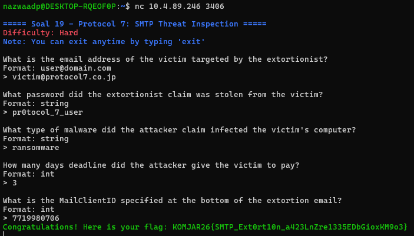

#### Kesimpulan

Protokol SMTP tanpa enkripsi (STARTTLS) memungkinkan seluruh isi email termasuk header kustom dan konten pesan sensitif dapat dibaca secara langsung oleh siapa pun yang mampu menyadap lalu lintas jaringan, sebagaimana dibuktikan melalui rekonstruksi lengkap isi email ancaman pada analisis ini.

### Soal 20

Untuk rencana pamungkasnya, Eiri menyembunyikan komunikasi malware di balik saluran terenkripsi TLS. Namun Alice telah menyediakan file keylog untuk mendekripsi lalu lintas data tersebut. Analisis file capture wired_tls_decrypt.pcapng bersama keyslogfile.txt untuk mengidentifikasi versi protokol TLS yang dinegosiasikan, nama domain (SNI) yang diakses, alamat IP server HTTPS penyerang, User-Agent yang digunakan, serta HTTP request method dan path yang tersembunyi di dalam sesi dekripsi. Validasi temuan kalian pada socket server: ([link file](https://drive.google.com/file/d/1F7xN3ydIrA-pZaCb32MGseVeHKt-D_qZ/view?usp=sharing)) nc [IP_Group] 3407

#### Metodologi Analisis

**a. Konfigurasi dekripsi TLS pada Wireshark**

Melalui menu **Edit → Preferences → Protocols → TLS**, field **(Pre)-Master-Secret log filename** diarahkan ke file `keyslogfile.txt` yang telah diunduh.

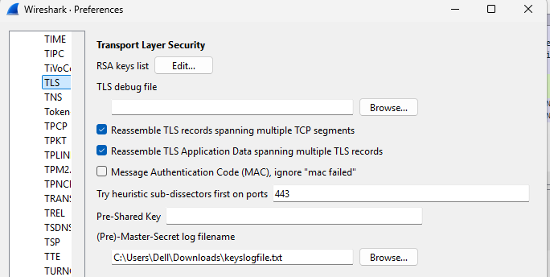

**b. Identifikasi versi protokol TLS dan SNI**

File `wired_tls_decrypt.pcapng` dibuka, filter diterapkan:

```
tls.handshake.type == 1
```

Pada paket **Client Hello**, terlihat nama server dan versinya serta SNI.

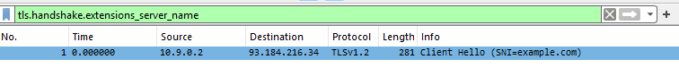

**c. Identifikasi konten HTTP yang tersembunyi dalam sesi terdekripsi**

Filter diubah ke:

```
http
```

Dengan keylog yang sudah dimuat, Wireshark secara otomatis mendekripsi traffic HTTPS sehingga dapat ditampilkan sebagai HTTP biasa. Diperiksa header **User-Agent**, serta method dan path pada request line.

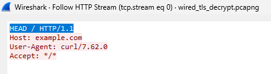

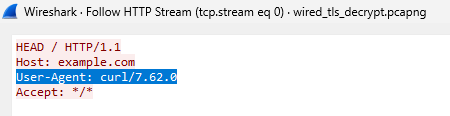

**d. Identifikasi IP server**

Diambil dari field **Destination** pada paket-paket HTTP yang telah terdekripsi.

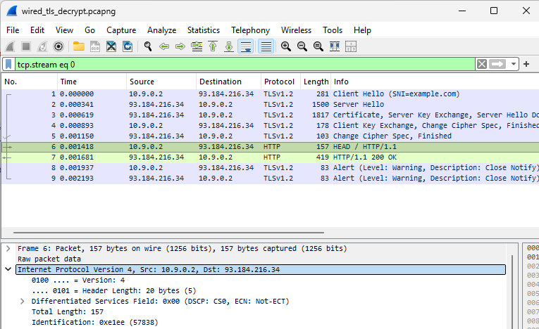

#### Hasil Temuan

| Item                             | Nilai             |
| -------------------------------- | ----------------- |
| Versi protokol TLS               | `TLSv1.2`         |
| Domain (SNI) yang diakses        | `example.com`     |
| Alamat IP server HTTPS penyerang | `93.184.216.34`   |
| User-Agent                       | `curl/7.62.0`     |
| HTTP Request Method+Path         | `HEAD / HTTP/1.1` |

#### Validasi Temuan

```bash
nc 10.4.89.246 3407
```

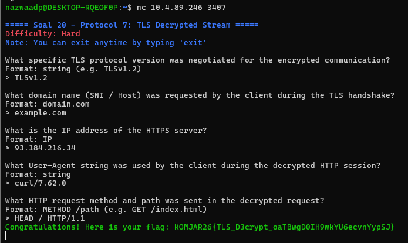

#### Kesimpulan

Meskipun TLS dirancang untuk mengenkripsi seluruh komunikasi HTTP, ketersediaan file keylog (SSLKEYLOGFILE) memungkinkan pihak yang berwenang atau dalam konteks forensik keamanan untuk mendekripsi dan menganalisis isi komunikasi tersebut secara penuh. Hal ini menegaskan bahwa keamanan TLS bergantung sepenuhnya pada kerahasiaan kunci sesi, dan analisis ini membuktikan bahwa struktur data di balik enkripsi TLS pada dasarnya identik dengan HTTP biasa yang dibungkus lapisan kriptografi.
